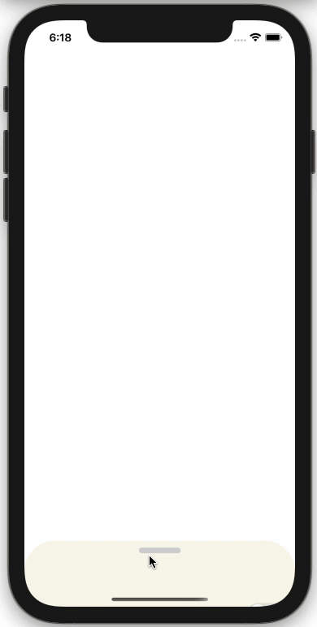

# Milestone 1 Reflection

## Project Team 26
   * Hongyang Lin
   * Youhan Dou
   * Siyao Li

## Original Goals
* The ability to create and store notes.
* Make daily to-do lists.
* Design and implement a simple app logic.

## Project Progress and Reflection
### Main Menu
* 
* 
* 

### Note
* We have designed a Note data type to store the relevant informations for a note. (etc. title, content, isFavorite)
* We have implemented the functionality of creating notes, viewing notes, and adding notes to favorite.
* We also provided the option to view the favorite-only notes filtered from all the notes.

### Todo List
* 
* 
* 

## Video Demonstration
<!--  -->

